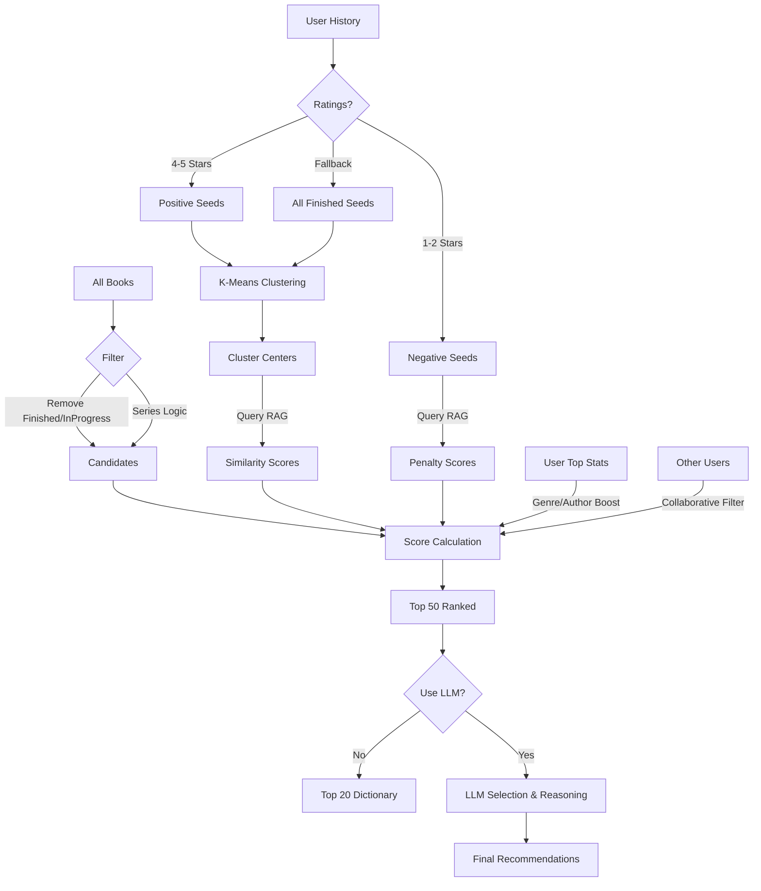

# Recommendation Algorithm Documentation

This document explains the inner workings of the audiobook recommendation system used in this project. The system employs a hybrid approach combining **Retrieval-Augmented Generation (RAG)**, **Collaborative Filtering**, **User Preference Weighting**, and optionally an **LLM (Large Language Model)** for final presentation.

## Overview

The recommendation engine is designed to suggest books based on a user's reading history, specific ratings, and implied taste profiles. It operates in several distinct stages:

1.  **Data Ingestion & Filtering**: Fetching books and filtering out finished/in-progress items.
2.  **RAG-Based Scoring**: Using vector embeddings to find books similar to what the user likes.
3.  **User Preference Boosting**: Weighting candidates based on top genres and authors.
4.  **Collaborative Filtering**: Boosting books liked by similar users.
5.  **LLM Refinement (Optional)**: Using an LLM to select and explain the final recommendations.

---

## 1. Data Ingestion & Filtering

Before any ranking occurs, the system compiles a list of valid candidate books.

-   **Source**: Fetches all items from the Audiobookshelf library.
-   **Exclusions**:
    -   Books already marked as `finished`.
    -   Books currently `in_progress`.
    -   Books that duplicate the `(title, author)` of finished books.
-   **Series Logic**:
    -   If a book is part of a series, the system ensures *sequential consistency*.
    -   It only recommends the **next** unread book in the series sequence (e.g., Book 2 is only a candidate if Book 1 is finished).
    -   If no sequence number is available, the first available book in the series is chosen.

## 2. RAG-Based Scoring (The Core)

The core mechanism uses **Vector Embeddings** to understand semantic similarity between books.

### The RAG System
-   **Embeddings**: Uses `jina-embeddings-v3` (via ONNX) to convert book metadata (Title, Author, Genres, Tags, Series, Description) into high-dimensional vectors.
-   **Vector Store**: Stores these embeddings in a **ChromaDB** collection (`audiobooks_v3_onnx`).

### Ranking Algorithm
The system ranks unread books using a **Two-Phase** approach based on user ratings (1-5 stars).

#### Phase 1: The "Like" Query
1.  **Seed Selection**: Identifies books the user rated **4 or 5 stars**. If no positive ratings exist, it falls back to *all* finished books.
2.  **Clustering (Taste Profiles)**: Instead of averaging all liked books into a single "mean vector" (which dilutes distinct tastes), the system performs **K-Means Clustering** (max 5 clusters) on the seed embeddings. This identifies distinct "clusters" of interest (e.g., "Sci-Fi Space Opera" vs. "Cozy Mystery").
3.  **Retrieval**: The system queries the Vector Store for books similar to *each* cluster center.
4.  **Scoring**:
    -   Similarity translates to a base score (0-100).
    -   Books found via "Positive" ratings get a **2.0x multiplier**.
    -   Scores are **accumulative**: If a book matches multiple user taste clusters, its score increases.

#### Phase 2: The "Dislike" Penalty
1.  **Seed Selection**: Identifies books the user rated **1 or 2 stars**.
2.  **Retrieval**: Finds books semantically similar to these negative examples.
3.  **Penalty**: Applies a **negative score** (1.5x weight) to these candidates, effectively pushing them down or off the list.

## 3. User Preference Boosting

On top of semantic similarity, the system applies explicit boosts for metadata matches:
-   **Top Genres**: +10 points if the book matches one of the user's top 5 most-read genres.
-   **Top Authors**: +15 points if the book matches one of the user's top 5 most-read authors.

## 4. Collaborative Filtering

The system attempts to find "reading soulmates" to diversify recommendations.

1.  **User Similarity**: It compares the current user's *taste clusters* with every other user's *finished book embeddings*.
2.  **Matching**: If another user has a taste cluster that is highly similar (cosine similarity > 0.6) to one of the current user's clusters.
3.  **Boosting**:
    -   The system retrieves recommendations based on the *similar user's* matching cluster.
    -   Books that appear in this set receive a **score boost** (Score += 15 * Similarity).
    -   **Match Reason**: These books are flagged with "Highly relevant to similar user 'Username'".

## 5. Final Selection & LLM Integration

### Candidate Selection
The top **50** books with the highest calculated scores are selected as candidates.

### Mode A: RAG-Only (Fast)
If the LLM is disabled:
-   Returns the top 20 candidates directly.
-   Generates static reasons based on score breakdown (e.g., "Matches your reading profile", "Similar to books you loved").

### Mode B: LLM Generation (Smart)
If the LLM is enabled:
1.  **Prompt Construction**: A text prompt is built containing:
    -   A list of the User's recently finished books.
    -   The list of Top 50 Candidates (Title, Author, Series, Description).
    -   A system instruction (loaded from language files) telling the LLM to pick the best fits and explain why.
2.  **Generation**: The LLM (e.g., via Ollama/OpenAI compatible API) returns a JSON response with the selected books and personalized reasons.
3.  **Mapping**: The system maps the LLM's selected IDs back to the original book objects to ensure data integrity.

## Architecture Diagram

