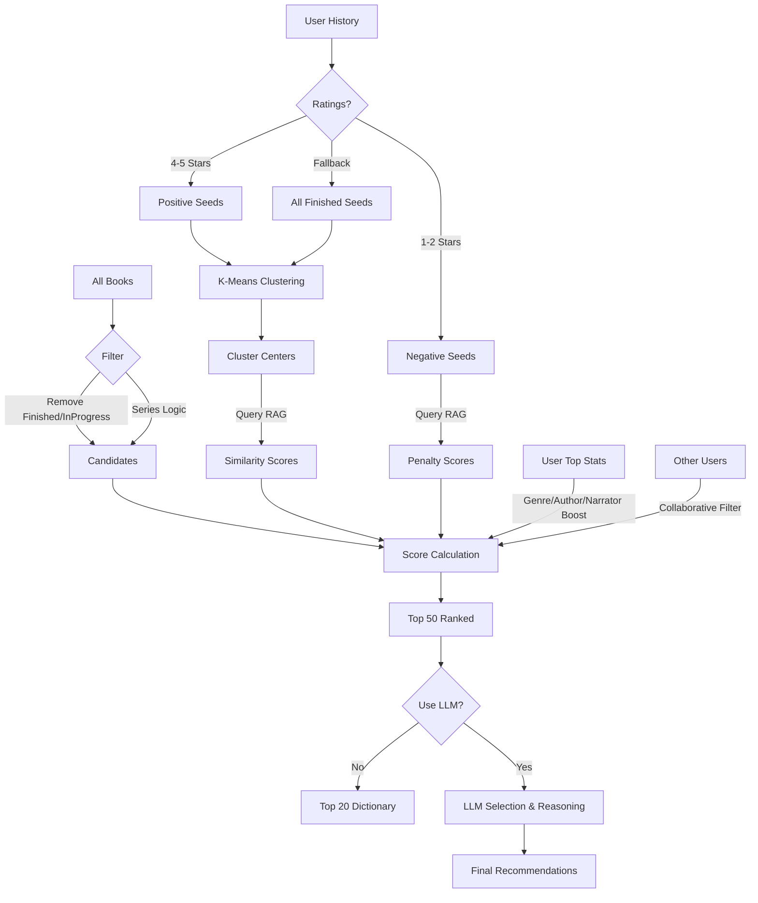

# Recommendation Algorithm Documentation

This document explains the inner workings of the audiobook recommendation system used in this project. The system employs a hybrid approach combining **Retrieval-Augmented Generation (RAG)**, **Collaborative Filtering**, **User Preference Weighting**, and optionally an **LLM (Large Language Model)** for final presentation.

## Overview

The recommendation engine is designed to suggest books based on a user's reading history, specific ratings, and implied taste profiles. It operates in several distinct stages:

1.  **Data Ingestion & Filtering**: Fetching books and filtering out finished/in-progress items.
2.  **RAG-Based Scoring**: Using vector embeddings to find books similar to what the user likes.
3.  **User Preference Boosting**: Weighting candidates based on top genres and authors.
4.  **Collaborative Filtering**: Boosting books liked by similar users.
5.  **LLM Refinement (Optional)**: Using an LLM to select and explain the final recommendations.

---

## 1. Data Ingestion & Filtering

Before any ranking occurs, the system compiles a list of valid candidate books.

-   **Source**: Fetches all items from the Audiobookshelf library.
-   **Exclusions**:
    -   Books already marked as `finished`.
    -   Books currently `in_progress`.
    -   Books that duplicate the `(title, author)` of finished books.
-   **Series Logic**:
    -   If a book is part of a series, the system ensures *sequential consistency*.
    -   It only recommends the **next** unread book in the series sequence (e.g., Book 2 is only a candidate if Book 1 is finished).
    -   If no sequence number is available, the first available book in the series is chosen.

## 2. RAG-Based Scoring (The Core)

The core mechanism uses **Vector Embeddings** to understand similarity between books. In v2, this has been upgraded to a **Two-Stream** approach to separate "what a book is about" from "who made it."

### The RAG System
The system maintains two distinct vector collections in **ChromaDB**:

1.  **Content Collection** (`audiobooks_content_v1`):
    -   **Purpose**: Semantic matching of plot, mood, and themes.
    -   **Input**: Genres + Tags + Description.
    -   **Weight**: **60%** of the matching score.

2.  **Metadata Collection** (`audiobooks_metadata_v1`):
    -   **Purpose**: Structural matching of creators and format.
    -   **Input**: Title + Author + Narrator + Series + Duration (rounded).
    -   **Weight**: **40%** of the matching score.

### Ranking Algorithm
The system ranks unread books using a **Normalized Weighted Average** approach. This ensures that a perfect semantic match isn't overpowered by simple metadata matches.

#### 1. Score Calculation (Two-Pass Normalization)
Instead of adding raw numbers, the system calculates two separate scores for every candidate and normalizes them to a 0-1 range.

1.  **RAG Score (Similarity)**: Derived from the cosine distance between User and Book embeddings.
2.  **Preference Score (Metadata)**: Derived from explicit matches with the user's top Genres, Authors, and Narrators.

The system finds the *Maximum RAG Score* and *Maximum Preference Score* across all candidates in the current batch.

#### 2. Normalization & Weighting
Each booklet's score is normalized against the batch maximums:
-   `Norm_RAG = Raw_RAG / Max_RAG`
-   `Norm_Pref = Raw_Pref / Max_Pref`

The final score is a weighted combination:
`Final_Score = (Norm_RAG * 0.7) + (Norm_Pref * 0.3)`

> This 70/30 split prioritizes semantic relevance (Plot/Theme) while still using User Preferences (Author/Genre) as a significant tie-breaker.

## 3. User Preference Boosting

On top of semantic similarity, the system calculates a raw preference score which is then normalized:
-   **Top Genres**: +10 (raw)
-   **Top Authors**: +15 (raw)
-   **Top Narrators**: +5 (raw)

*Note: These raw values are relative. If the highest preference score in a batch is 15, a book with 15 points gets a `Norm_Pref` of 1.0.*

## 4. Collaborative Filtering

The system attempts to find "reading soulmates" to diversify recommendations.

1.  **User Similarity**: It compares the current user's *taste clusters* with every other user's *finished book embeddings*.
2.  **Matching**: If another user has a taste cluster that is highly similar (cosine similarity > 0.6).
3.  **Boosting**:
    -   Books liked by the similar user receive a boost.
    -   **Scaled Boost**: `Score += 0.15 * Similarity` (Scaled to match the 0-1 normalized system).
    -   **Match Reason**: These books are flagged with "Highly relevant to similar user 'Username'".

## 5. Final Selection & LLM Integration

### Candidate Selection
The top **50** books with the highest calculated scores are selected as candidates.

### Mode A: RAG-Only (Fast)
If the LLM is disabled:
-   Returns the top 20 candidates directly.
-   Generates static reasons based on score breakdown (e.g., "Matches your reading profile", "Similar to books you loved").

### Mode B: LLM Generation (Smart)
If the LLM is enabled:
1.  **Prompt Construction**: A text prompt is built containing:
    -   A list of the User's recently finished books.
    -   The list of Top 50 Candidates (Title, Author, Series, Description).
    -   A system instruction (loaded from language files) telling the LLM to pick the best fits and explain why.
2.  **Generation**: The LLM (e.g., via Ollama/OpenAI compatible API) returns a JSON response with the selected books and personalized reasons.
3.  **Mapping**: The system maps the LLM's selected IDs back to the original book objects to ensure data integrity.

## Architecture Diagram

